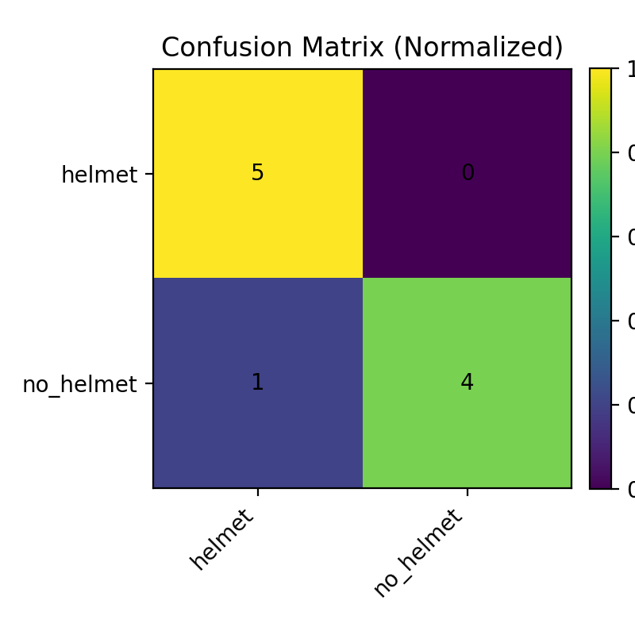

# Helmet vs No-Helmet Classifier (ResNet18)

**Goal:** Classify if a person is wearing a safety helmet from an image.

**Tech:** PyTorch, TorchVision, transfer learning (ResNet18), ONNX export.

## Results (from Kaggle run)
- Train/Val/Test split: 70/15/15 on a small demo dataset (49 images total)
- Best validation accuracy: **100%**
- Test accuracy: **90%**
- Confusion Matrix (test):



## Quickstart (Local)
```bash
python -m venv .venv
.venv\Scripts\activate
pip install -r requirements.txt
python infer.py sample_images/Helmet6.jpg
python infer.py sample_images/WithoutHelmet9.jpg

